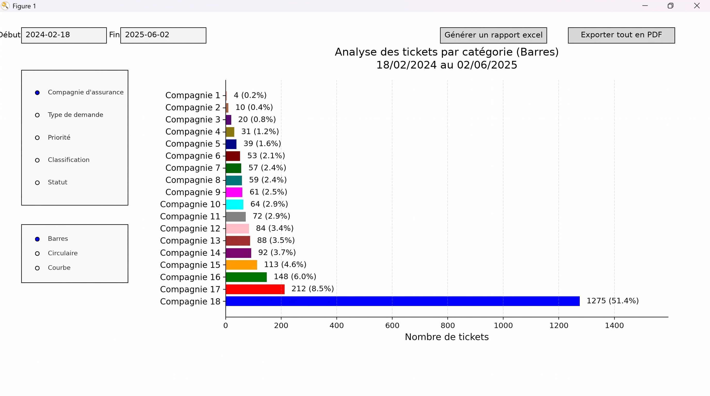

# 📊 Ticket Analysis Dashboard

Application Python interactive développée dans le cadre d'un **stage d'été à la Fédération Tunisienne des Sociétés d'Assurances (FTUSA)**.

L'objectif du projet est de faciliter l'analyse et la visualisation des tickets de support à travers une interface interactive permettant d'explorer différentes catégories de données et de générer des rapports.

## 📸 Aperçu du dashboard

Voici un aperçu de l'interface du dashboard développé en Python pour l'analyse et la visualisation des tickets.

> *Les informations visibles dans la capture ont été anonymisées afin de préserver la confidentialité des données utilisées durant le projet.*




## 🎯 Objectifs du projet

L'application permet de :

* analyser les tickets sur une période donnée ;
* analyser les tickets par compagnie d'assurance ;
* analyser les tickets par type de demande ;
* analyser les tickets par priorité ;
* analyser les tickets par classification ;
* analyser les tickets par statut ;
* visualiser les résultats sous différentes formes ;
* générer des rapports Excel ;
* exporter les visualisations au format PDF.

## 📊 Visualisations

L'application propose trois types de visualisations :

* 📊 **Graphique à barres**
* 🥧 **Graphique circulaire**
* 📈 **Graphique en courbe**

Les visualisations peuvent être filtrées selon la période sélectionnée et la catégorie d'analyse.

## 🔎 Analyse détaillée

L'application permet d'effectuer une analyse détaillée des tickets associés à une compagnie d'assurance.

En sélectionnant une compagnie dans le graphique principal, l'utilisateur peut consulter la répartition de ses différents types de demandes.

## 📑 Génération de rapports

### Rapport Excel

L'application permet de générer automatiquement un rapport Excel comprenant notamment :

* un résumé de la période analysée ;
* le nombre total de tickets ;
* la répartition des tickets par compagnie ;
* la répartition par type de demande ;
* la répartition par priorité ;
* la répartition par classification ;
* l'analyse des types de demandes par compagnie.

### Rapport PDF

Les différentes visualisations peuvent également être exportées dans un fichier PDF afin de faciliter la présentation des résultats.

## 🛠️ Technologies utilisées

* **Python**
* **Pandas** — nettoyage, manipulation et analyse des données
* **NumPy** — calculs numériques
* **Matplotlib** — visualisation des données et interface interactive
* **XlsxWriter** — génération des rapports Excel
* **CSV** — lecture et traitement des données

## 📁 Structure du projet

```text
ticket-analysis-dashboard/
│
├── analyse_tickets.py
├── README.md
└── images/
    └── dashboard.png
```

## 🎓 Contexte

Ce projet a été réalisé dans le cadre d'un **stage d'été à la Fédération Tunisienne des Sociétés d'Assurances (FTUSA)**.

Il m'a permis de mettre en pratique des compétences en :

* développement Python ;
* manipulation et nettoyage de données ;
* analyse de données ;
* visualisation de données ;
* création d'interfaces graphiques ;
* automatisation de rapports ;
* export de données et de visualisations.
Pour des raisons de sécurité et de confidentialité des données, certains fichiers utilisés durant le projet ne sont pas inclus dans ce dépôt GitHub.
## 👨‍💻 Auteur

**Mayssa Ahmed**

Stage d'été — FTUSA
